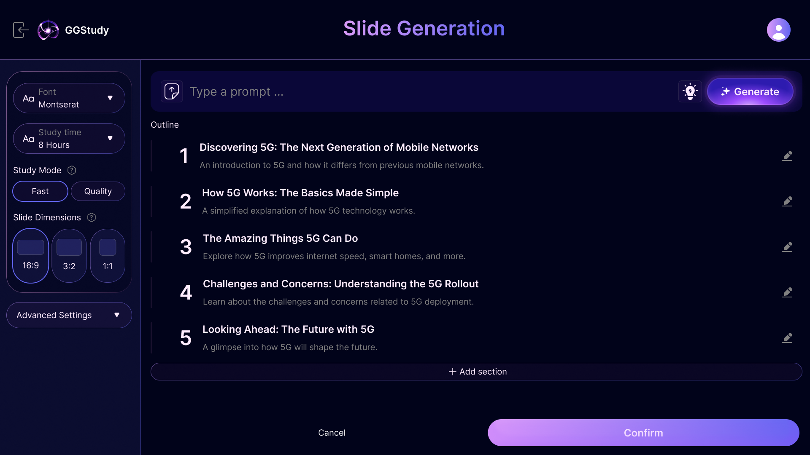

# GGStudy

## 1. Introduction

In today’s fast-paced world, learning new skills and staying updated is more challenging than ever. Traditional methods
like reading books are time-consuming and often inefficient. What if there was a faster, more effective way to learn?

Our AI-powered application creates interactive slides with voiceovers that teach you just like in the real world. With
personalized courses, agent chatbots, and highlighted key points, you’ll grasp concepts faster without wading through
dense textbooks

GGStudy is a smart learning platform that uses artificial intelligence (AI), specifically Gemini, to create customized
learning slides, facilitating efficient and accessible learning through a structured roadmap and continuous interaction.

Demo Video: [Coming Soon](#)

## 2. Key Features

- [WIP] Interactive Slides: "Dynamic slides with voiceovers and highlights for focused learning."
- [WIP] Personalized Courses: "AI customizes your learning path based on your goals and progress."
- [WIP] Agent Chatbot: "Get instant answers and guidance from our intelligent chatbot."
- [Plan] Real-Time Feedback: "Receive immediate feedback to reinforce your learning."
- [Plan] Gamified Learning: "Unlock achievements and track progress with our gamified system."

## 3. Technologies

- [Done MVP] Frontend: React, Vite, Tailwind CSS
- [Done MVP] Backend: MySQL, Spring Boot
- [Done MVP] Gemini
- [Plan] RAG Stack: Redis, Apollo, GraphQL
- [Plan] Dify for RAG

## 4. Diagram

## 5. More information

- Growth trend: The online learning market has been exploding rapidly, especially after the COVID-19 pandemic. The shift
  from traditional to online learning has fostered the need for smart and accessible learning platforms. According to a
  report by Global Market Insights, the global E-learning market is expected to reach a valuation of 325 billion USD by
    2025. ( link )
- Personalization needs: Learners increasingly seek learning solutions tailored to their needs and interests. More than
  just accessing content, learners want customized and highly interactive learning paths, helping to increase learning
  efficiency.

- Diverse subjects:. Individuals across all age groups, from students to professionals, have diverse learning needs.
  They not only seek academic knowledge but also aim to enhance their professional skills, pursue personal development,
  and prepare for examinations.
- Optimize time: In a fast-paced lifestyle, users want to be able to study effectively without spending too much time.
  This requires learning platforms to provide courses that are short, concise, and easy to understand.

